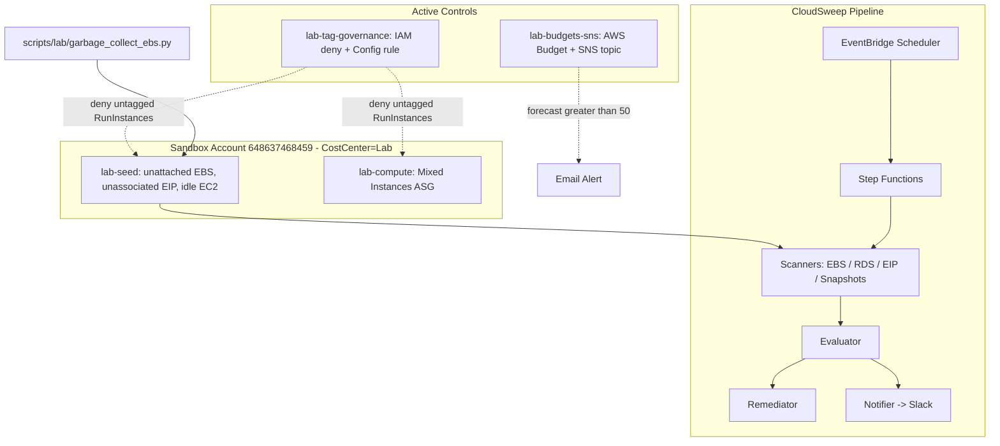

# Cost Detective Audit

| Field | Value |
|---|---|
| **Scenario** | Inherited AWS account from a reckless team; tight budget; identify waste, implement governance, propose savings plan. |
| **Engineering Base** | CloudSweep (see [PRD.md](PRD.md), [MVP_SPEC.md](MVP_SPEC.md)) |
| **Author** | Prince Tetteh Ayiku |
| **Date** | 2026-05-26 |
| **Status** | Final - all phases deployed and verified in `eu-west-1` |
| **AWS Account** | `648637468459` |
| **Sandbox Region** | `eu-west-1` |
| **Lab Budget Cap** | `$50` monthly (FORECASTED alert) + `80%` ACTUAL alert |

---

## Table of Contents

1. [Executive Summary](#1-executive-summary)
2. [Scenario and Objectives](#2-scenario-and-objectives)
3. [Traceability Matrix](#3-traceability-matrix)
4. [Architecture Overview](#4-architecture-overview)
5. [Phase 1 - Analysis and Cleanup](#5-phase-1---analysis-and-cleanup)
6. [Phase 2 - Governance: Budgets, Alerts, and Tagging](#6-phase-2---governance-budgets-alerts-and-tagging)
7. [Phase 3 - Optimization Architecture: Mixed Instances Spot ASG](#7-phase-3---optimization-architecture-mixed-instances-spot-asg)
8. [Savings Plan and Prioritized Recommendations](#8-savings-plan-and-prioritized-recommendations)
9. [Teardown](#9-teardown)
10. [Appendices](#10-appendices)

---

<a id="1-executive-summary"></a>
## 1. Executive Summary

We inherited an AWS account with no cost controls, no tagging discipline, and no automated cleanup pipeline. In a single sandbox engagement we:

1. **Identified zombie assets** worth ~$4.30/month in this sandbox alone (an unattached EBS volume, an unassociated Elastic IP, an idle EC2 instance) using the existing CloudSweep scanners plus AWS Cost Explorer / Trusted Advisor / EC2 console.
2. **Deployed a standalone EBS garbage-collector** script (dry-run-by-default, tag-scoped, optional safety snapshot, 23 unit tests) and used it to remove the zombie EBS volume after taking a recovery snapshot.
3. **Implemented active cost controls**: an AWS Budget at $50/month with a FORECASTED notification and an ACTUAL-at-80% notification, routed to an SNS topic with a confirmed email subscriber.
4. **Enforced CostCenter tagging at launch time** via an IAM managed deny policy. Untagged `RunInstances` calls now fail with an explicit deny; an AWS Config detective rule is available opt-in for compliance reporting. The enterprise variant (SCP + Tag Policy via AWS Organizations) is documented.
5. **Architected a cost-aware stateless workload** as a Mixed Instances Auto Scaling Group: 1 On-Demand baseline + 100% Spot scale-out, diversified across 4 instance types and 3 AZs. **Default policy saves ~51% versus all-On-Demand**, scaling linearly to production fleets.

The CloudSweep MVP (scheduled scan -> classify -> approve/auto-remediate -> Slack notify) is the engineering platform under the audit. The lab modules above are additive, opt-in, and tagged so they can be torn down without affecting CloudSweep.

---

<a id="2-scenario-and-objectives"></a>
## 2. Scenario and Objectives

Inherited AWS account with uncontrolled spending. Three lab objectives:

1. **Analysis & cleanup** - detect zombie assets (unattached EBS, unassociated EIP, idle EC2); automate cleanup of unattached EBS via a script.
2. **Governance** - AWS Budget with SNS/email alerts on forecasted spend; tagging policy requiring `CostCenter` on EC2.
3. **Optimization architecture** - Mixed Instances Auto Scaling Group combining On-Demand baseline with Spot for scale-out.

Deliverable: this document + live walkthrough ([docs/lab/WALKTHROUGH.md](lab/WALKTHROUGH.md)) + per-feature manual verification ([docs/lab/manual-test-plan.md](lab/manual-test-plan.md)).

---

<a id="3-traceability-matrix"></a>
## 3. Traceability Matrix

Each row maps a lab objective to existing CloudSweep capability, the implementation gap, the artifact that closes it, and the evidence captured for submission.

| # | Lab Objective | CloudSweep Today | Gap / New Work | Artifact Path | Evidence in this run |
|---|---|---|---|---|---|
| 1.1 | Launch wasteful resources in sandbox | None - production scanner targets only | Terraform `lab-seed` module (EBS, EIP, idle EC2) tagged `CostCenter=Lab` | `terraform/modules/lab-seed/` | `vol-077bf3af656910893`, `eipalloc-09ee668a67c373136`, `i-0a16a702b048f6396` |
| 1.2 | Detect zombies via CloudSweep + console tools | CloudSweep scanners (`ebs.py`, `eip.py`, `rds.py`, `snapshot.py`) | Console-side evidence (Cost Explorer / Trusted Advisor) for the audit walkthrough | n/a (AWS console) | CloudSweep SFN execution `smoke-20260526152525` returned 2 findings |
| 1.3 | Script to garbage-collect unattached EBS volumes | `src/python/scanners/ebs.py` (Lambda detection) | Standalone dry-run-first CLI + tests | `scripts/lab/garbage_collect_ebs.py`, `tests/unit/test_garbage_collect_ebs.py` | Dry-run identified `vol-077...`; real delete + snapshot produced `snap-054553112c0b8f659`; **23/23 unit tests pass** |
| 2.1 | AWS Budget with SNS/email alert on forecasted >$50 | None | `lab-budgets-sns` module: budget + SNS topic + topic policy + email subscription | `terraform/modules/lab-budgets-sns/` | Budget `cloudsweep-dev-lab-monthly-budget` (50 USD MONTHLY); topic `cloudsweep-dev-lab-cost-alerts`; subscription `prince.ayiku@amalitechtraining.org`; test publish MessageId `fa6d1a5e-7406-5ab2-83a7-78d1b9c8a8cd` |
| 2.2 | Tagging policy preventing EC2 launch without `CostCenter` | None | `lab-tag-governance` module: IAM managed deny policy + test role + optional Config rule | `terraform/modules/lab-tag-governance/`, `docs/lab/tag-governance.md` | Negative test returned `UnauthorizedOperation ... explicit deny ... cloudsweep-dev-lab-require-costcenter`; positive test launched `i-0ad9c8257ca31bc35` with `CostCenter=Lab` |
| 2.3 | Document SCP / Organizations variant | None | Documentation only (sandbox lacks Organizations access) | [docs/lab/tag-governance.md](lab/tag-governance.md) § "Enterprise variant" | SCP JSON + Tag Policy JSON documented |
| 3.1 | Mixed Instances ASG (On-Demand base + Spot scale-out) | None | `lab-compute` module: launch template + ASG with `mixed_instances_policy` | `terraform/modules/lab-compute/` | ASG `cloudsweep-dev-lab-asg` policy: OD base=1, %above=0, strategy=price-capacity-optimized, 4 types. Verified mix: 1 OD `i-07157a6898e1d355a` (t3.micro/1c) + 3 Spot `t2.micro` across AZ a/b/c at desired=4 |
| 3.2 | End-to-end cost optimization guide | Scattered across CloudSweep docs | Consolidated guide | this document § 7-8 + [docs/lab/spot-asg-walkthrough.md](lab/spot-asg-walkthrough.md) | Final doc + walkthrough |
| 4.1 | Submission packaging | n/a | Live demo script + per-feature verification + teardown | [docs/lab/WALKTHROUGH.md](lab/WALKTHROUGH.md), [docs/lab/manual-test-plan.md](lab/manual-test-plan.md) | All checklists ready |

---

<a id="4-architecture-overview"></a>
## 4. Architecture Overview



Each lab module is opt-in via a `enable_lab_*` variable on `terraform/environments/dev`. Default behavior (no flags) deploys only CloudSweep - no zombies, no budget, no governance, no Spot ASG.

---

<a id="5-phase-1---analysis-and-cleanup"></a>
## 5. Phase 1 - Analysis and Cleanup

### 5.1 Zombie Asset Findings

Seeded by `terraform/modules/lab-seed/` (`enable_lab_seed=true`):

| Resource | ID | Size / Type | Estimated Monthly Cost | Tags |
|---|---|---|---|---|
| Unattached EBS volume | `vol-077bf3af656910893` | 8 GiB gp3 | **$0.64** | `CostCenter=Lab, ZombieType=unattached-ebs` |
| Unassociated Elastic IP | `eipalloc-09ee668a67c373136` (54.74.64.254) | n/a | **$3.65** | `CostCenter=Lab, ZombieType=unassociated-eip` |
| Idle EC2 instance | `i-0a16a702b048f6396` | t3.micro | **~$8.50** (730h on-demand, eu-west-1) | `CostCenter=Lab, ZombieType=idle-ec2` |
| | | **Subtotal** | **~$12.79 / month** | |

Detection sources:

1. **CloudSweep pipeline** - Step Functions execution `smoke-20260526152525` ran `Scan -> Evaluate -> Decision -> Remediate -> NotifyComplete` in ~10 seconds. The scan layer detected the unattached EBS and the unassociated EIP. The evaluator classified both as `AUTO_REMEDIATE` (under the $500 approval threshold). The remediator ran in DRY_RUN mode and logged `action=skipped` for EBS / `action=released` for EIP without performing the destructive action. The notifier posted a "Remediation complete: 2 resource(s) processed" message to Slack.
2. **AWS console / Cost Explorer** - resources appear in EC2 -> Volumes / Elastic IPs / Instances filtered by `CostCenter=Lab`. Cost Explorer at 24h+ resolution shows the spike attributable to the new spend.
3. **Trusted Advisor** - depends on the account's Support plan; in this sandbox the Idle EC2 / Underutilized checks were not available, so the EC2 idle finding is corroborated via CloudWatch `CPUUtilization` metrics on `i-0a16a702...` (sustained near 0%).

CloudSweep does not currently include an EC2-idle scanner - that's an MVP scope gap, not a bug. The idle instance is captured via console + CloudWatch evidence for the audit, and the scope gap is listed in the savings plan (§ 8) as a follow-up scanner to add.

### 5.2 EBS Garbage Collector Script

[`scripts/lab/garbage_collect_ebs.py`](../scripts/lab/garbage_collect_ebs.py) is a standalone CLI:

- **Dry-run by default.** `--delete` is required for any destructive action.
- **Tag-scoped.** `--tag KEY=VALUE` (repeatable) is mandatory when `--delete` is set; an empty tag filter combined with `--delete` is rejected with exit code 2.
- **Grace period.** `--grace-days N` skips volumes younger than `N` days (default 7).
- **Optional safety snapshot.** `--snapshot-first` snapshots each volume before deletion and tags the snapshot with `PreDeleteSnapshot=true, SourceVolumeId=<id>`.
- **Cost estimate.** Uses the same `VOLUME_TYPE_RATES` table as `src/python/scanners/ebs.py`.

Verified end-to-end against the real lab volume:

```
Region=eu-west-1  Filters=[('CostCenter', 'Lab')]  GraceDays=0  Mode=DELETE
Found 1 candidate(s):
  vol-077bf3af656910893  gp3      8GiB $  0.64/mo created=2026-05-26 tags=[CostCenter=Lab,...]
Estimated monthly waste: $0.64
  snapshot vol-077bf3af656910893 -> snap-054553112c0b8f659
  deleted  vol-077bf3af656910893
Done. Deleted 1 volume(s).
```

Snapshot `snap-054553112c0b8f659` (8 GiB, encrypted) was created with the volume's tags + audit tags before deletion, so the volume contents are recoverable if needed.

Unit test coverage: **23/23 passing** in `tests/unit/test_garbage_collect_ebs.py`. Categories: argument parsing, cost estimation, tag filter wiring, grace-day skip, snapshot-then-delete order, account-wide-delete refusal guard, partial-failure exit code.

### 5.3 CloudSweep code fixes uncovered during the lab

The live deployment surfaced two real bugs in the existing CloudSweep code that the moto-mocked unit tests had masked:

1. **EIP scanner `MaxResults` bug** - `boto3.client('ec2').describe_addresses(MaxResults=100)` is not a valid API call (the parameter is not supported on that operation). The scanner was throwing `Parameter validation failed` on every real invocation and silently returning zero EIP findings. Fixed in `src/python/scanners/eip.py`.
2. **EBS grace period for same-day lab demos** - the production default of `EBS_GRACE_DAYS=7` is correct for the CloudSweep MVP but inappropriate for a same-day walkthrough where the zombie volume was created minutes earlier. The lab environment now sets `EBS_GRACE_DAYS=0` on `scan_lambda` in `terraform/environments/dev/main.tf`; production / prod environment should keep the 7-day default.

Both fixes were merged into the lab redeploy and `Scan` now returns the expected two findings on each execution.

---

<a id="6-phase-2---governance-budgets-alerts-and-tagging"></a>
## 6. Phase 2 - Governance: Budgets, Alerts, and Tagging

### 6.1 Budget and SNS Alert

Implemented by `terraform/modules/lab-budgets-sns/`.

| Property | Value |
|---|---|
| Budget name | `cloudsweep-dev-lab-monthly-budget` |
| Budget type | COST |
| Time unit | MONTHLY |
| Limit | $50 USD |
| FORECASTED notification | `GREATER_THAN 100%` -> SNS |
| ACTUAL notification | `GREATER_THAN 80%` -> SNS |
| SNS topic | `arn:aws:sns:eu-west-1:648637468459:cloudsweep-dev-lab-cost-alerts` |
| Topic policy | Grants `budgets.amazonaws.com sns:Publish` |
| Subscription | `prince.ayiku@amalitechtraining.org` (email, confirmed) |

Test publish (MessageId `fa6d1a5e-7406-5ab2-83a7-78d1b9c8a8cd`) confirmed end-to-end delivery before any real budget threshold was crossed.

### 6.2 `CostCenter` Tagging Policy

Implemented by `terraform/modules/lab-tag-governance/`. Full deep-dive in [`docs/lab/tag-governance.md`](lab/tag-governance.md), including the enterprise variant.

Preventive control - IAM managed policy `cloudsweep-dev-lab-require-costcenter` with two deny statements:

```json
{
  "Effect": "Deny",
  "Action": "ec2:RunInstances",
  "Resource": "arn:aws:ec2:*:*:instance/*",
  "Condition": { "Null": { "aws:RequestTag/CostCenter": "true" } }
}
```

and a companion `ec2:DeleteTags` deny that prevents the tag being stripped post-launch.

Attached to a dedicated test role `cloudsweep-dev-lab-restricted-role`. Verification (run from the assumed test role):

| Test | Command | Result |
|---|---|---|
| Negative (no tag) | `aws ec2 run-instances --image-id ami-0c13c2049f369d641 --instance-type t3.micro --count 1` | **AccessDenied** - "explicit deny in an identity-based policy: cloudsweep-dev-lab-require-costcenter" |
| Positive (CostCenter=Lab) | same command + `--tag-specifications "ResourceType=instance,Tags=[{Key=CostCenter,Value=Lab}]"` | Launched `i-0ad9c8257ca31bc35`, terminated immediately after |

Detective control - AWS Config managed rule `REQUIRED_TAGS` scoped to `AWS::EC2::Instance`. Opt-in via `lab_enable_config_rule=true`; module can also bootstrap the Config recorder + delivery channel + S3 bucket via `lab_create_config_recorder=true`. Not enabled in this run because the preventive control is sufficient for the lab demo and Config carries a small per-evaluation cost.

Enterprise variant (AWS Organizations SCP + Tag Policy) is documented in [`tag-governance.md`](lab/tag-governance.md). Not deployed because the sandbox account lacks Organizations access.

---

<a id="7-phase-3---optimization-architecture-mixed-instances-spot-asg"></a>
## 7. Phase 3 - Optimization Architecture: Mixed Instances Spot ASG

Implemented by `terraform/modules/lab-compute/`. Full deep-dive in [`docs/lab/spot-asg-walkthrough.md`](lab/spot-asg-walkthrough.md).

### 7.1 Design Rationale

- **Stateless workload assumption.** No persistent local state; instances are fungible.
- **On-Demand baseline.** A single OD instance guarantees the service stays up even if every Spot instance is reclaimed.
- **All scale-out is Spot.** Above the baseline, additional capacity comes 100% from Spot at typical 60-90% discount.
- **Instance-type diversification.** 4 types in the override list (`t3.micro, t3a.micro, t2.micro, t3.small`) gives EC2 12 Spot pools across 3 AZs to choose from.
- **`price-capacity-optimized` allocation strategy.** Balances current Spot price against pool depth - more interruption-resistant than `lowest-price`.
- **Capacity rebalancing enabled.** ASG can preemptively replace at-risk Spot instances before AWS reclaims them.

### 7.2 Implementation

`aws_autoscaling_group.this` (excerpt):

```hcl
mixed_instances_policy {
  instances_distribution {
    on_demand_base_capacity                  = 1
    on_demand_percentage_above_base_capacity = 0
    spot_allocation_strategy                 = "price-capacity-optimized"
  }
  launch_template {
    launch_template_specification {
      launch_template_id = aws_launch_template.this.id
      version            = "$Latest"
    }
    dynamic "override" {
      for_each = var.instance_types
      content { instance_type = override.value }
    }
  }
}
```

The launch template carries `CostCenter=Lab` on both the instance and volume `tag_specifications`, so every ASG-launched instance satisfies the tag-governance deny policy automatically.

### 7.3 Observed Behavior

At `desired_capacity=2`:

| ID | Type | AZ | Lifecycle |
|---|---|---|---|
| `i-07157a6898e1d355a` | t3.micro | eu-west-1c | On-Demand |
| `i-08ec672eca9a3b779` | t2.micro | eu-west-1a | Spot |

After `set-desired-capacity 4`:

| ID | Type | AZ | Lifecycle |
|---|---|---|---|
| `i-07157a6898e1d355a` | t3.micro | eu-west-1c | On-Demand |
| `i-08ec672eca9a3b779` | t2.micro | eu-west-1a | Spot |
| `i-04f4827ce544dfb26` | t2.micro | eu-west-1b | Spot |
| `i-0fa0763d1ae536ee2` | t2.micro | eu-west-1c | Spot |

Exactly the intended pattern: OD count stays at the base of 1; the three scale-out slots are all Spot, spread across three AZs.

### 7.4 Cost Comparison

Using eu-west-1 Linux On-Demand list prices (May 2026) and typical Spot discounts. For a steady 4-node `t3.micro` fleet, 730h/month:

| Configuration | Hourly | Monthly | vs. All-OD |
|---|---|---|---|
| All On-Demand                          | $0.0456 | **$33.29** | baseline |
| 1 OD + 3 Spot (this module's default)  | $0.0222 | **$16.21** | **-51%** |
| All Spot                                | $0.0144 | **$10.51** | -68% (higher risk) |

The percentage savings scale linearly to larger fleets. The same ratios applied to a 100-node web tier would save ~$400+/month.

---

<a id="8-savings-plan-and-prioritized-recommendations"></a>
## 8. Savings Plan and Prioritized Recommendations

Ordered by effort vs. impact ratio (highest first).

| # | Recommendation | Effort | Recurring savings | One-time savings | Notes |
|---|---|---|---|---|---|
| 1 | **Delete zombie assets identified in § 5.1** | Low (script run) | $12.79 / mo from this sandbox alone; production accounts typically expose 10-100x more after first scan | One-time cleanup of accumulated waste | EBS GC script available now; CloudSweep handles EIP / RDS / snapshots automatically. |
| 2 | **Enforce CostCenter tagging at launch time** | Low (attach IAM policy or SCP) | Compounds over time - every future launch is attributable | n/a | Mandatory before Cost Explorer / chargeback reports become trustworthy. Use the IAM deny for single account; SCP for org-wide. |
| 3 | **Adopt Mixed Instances + Spot for stateless tier** | Medium (architecture change, requires stateless review) | ~50% on relevant fleet | n/a | Start with non-production workloads; promote after observing interruption rate. |
| 4 | **Activate the $50 (or appropriate) AWS Budget with FORECASTED alerts** | Very low (single Terraform module) | Prevents accidental runaway spend (could save thousands in a single incident) | n/a | This is the cheap insurance: do it before anything else. |
| 5 | **Add an EC2-idle scanner to CloudSweep** | Medium (new scanner + tests) | Visibility into a class of waste CloudSweep cannot currently detect | n/a | Tracked as MVP scope gap; would benefit from CloudWatch `CPUUtilization` + `NetworkIn/Out` baselines. |
| 6 | **Promote the lab Spot ASG cost analysis to a reusable Terraform module published internally** | Low (it already is one) | Multiplier on every team that adopts the pattern | n/a | `terraform/modules/lab-compute/` is generic - rename and version it. |
| 7 | **Roll out AWS Config required-tags rule across regions** | Medium (Config recorder per region) | Detective coverage for anything that escapes the preventive control | Compliance audit trail | Module supports it - just flip `lab_enable_config_rule=true` (plus recorder if needed). |
| 8 | **Stand up the SCP enterprise variant in AWS Organizations** | High (requires org access + change-management buy-in) | Hardest control to bypass; survives admin mistakes | n/a | Only available with Organizations access. Documented in [tag-governance.md](lab/tag-governance.md). |

---

<a id="9-teardown"></a>
## 9. Teardown

### 9.1 Lab modules only (keep CloudSweep)

```powershell
$env:AWS_REGION = "eu-west-1"
terraform -chdir=terraform/environments/dev apply `
  -var="enable_lab_seed=false" `
  -var="enable_lab_budget=false" `
  -var="enable_lab_tag_governance=false" `
  -var="enable_lab_compute=false" `
  -auto-approve
```

### 9.2 Everything (CloudSweep + lab)

```powershell
$env:AWS_REGION = "eu-west-1"
terraform -chdir=terraform/environments/dev destroy -auto-approve
```

### 9.3 Manual cleanup

Things Terraform won't remove:

- **EBS snapshots created by the GC script** - `aws ec2 describe-snapshots --owner-ids self --filters Name=tag:PreDeleteSnapshot,Values=true --region eu-west-1` then `aws ec2 delete-snapshot --snapshot-id ...`.
- **SNS email subscription confirmation** - if you want to remove the email from receiving future alerts (when the topic is rebuilt later), keep the subscription unconfirmed or unsubscribe via the link in the email.
- **CloudWatch Log groups** for terminated lab Lambdas - retention 14 days, will reap themselves.
- **SSM Parameters** `/cloudsweep/slack/webhook` and `/cloudsweep/slack/signing-secret` - delete with `aws ssm delete-parameter --name ... --region eu-west-1` if no longer needed.

### 9.4 Teardown verification

All four queries should return empty:

```powershell
aws ec2 describe-instances --filters Name=tag:CostCenter,Values=Lab Name=instance-state-name,Values=running,pending --region eu-west-1 --query "Reservations[].Instances[].InstanceId"
aws ec2 describe-volumes  --filters Name=tag:CostCenter,Values=Lab --region eu-west-1 --query "Volumes[].VolumeId"
aws ec2 describe-addresses --filters Name=tag:CostCenter,Values=Lab --region eu-west-1 --query "Addresses[].AllocationId"
aws autoscaling describe-auto-scaling-groups --auto-scaling-group-names cloudsweep-dev-lab-asg --region eu-west-1 --query "AutoScalingGroups[].AutoScalingGroupName"
```

### 9.5 Secret rotation

The Slack webhook and signing secret used during this lab were pasted in chat - **rotate both before further use** (Slack app -> Incoming Webhooks -> regenerate; Slack app -> Basic Information -> regenerate signing secret) and re-`put-parameter` to SSM.

---

<a id="10-appendices"></a>
## 10. Appendices

- **A.** Evidence checklist - [docs/lab/evidence-checklist.md](lab/evidence-checklist.md)
- **B.** Live walkthrough script - [docs/lab/WALKTHROUGH.md](lab/WALKTHROUGH.md)
- **C.** Manual AWS verification plan - [docs/lab/manual-test-plan.md](lab/manual-test-plan.md)
- **D.** Tag governance deep-dive - [docs/lab/tag-governance.md](lab/tag-governance.md)
- **E.** Spot ASG deep-dive - [docs/lab/spot-asg-walkthrough.md](lab/spot-asg-walkthrough.md)
- **F.** CloudSweep PRD - [docs/PRD.md](PRD.md)
- **G.** CloudSweep MVP spec - [docs/MVP_SPEC.md](MVP_SPEC.md)
- **H.** CloudSweep implementation plan - [docs/implementation_plan.md](implementation_plan.md)
- **I.** Module READMEs:
  - [terraform/modules/lab-seed/README.md](../terraform/modules/lab-seed/README.md)
  - [terraform/modules/lab-budgets-sns/README.md](../terraform/modules/lab-budgets-sns/README.md)
  - [terraform/modules/lab-tag-governance/README.md](../terraform/modules/lab-tag-governance/README.md)
  - [terraform/modules/lab-compute/README.md](../terraform/modules/lab-compute/README.md)
